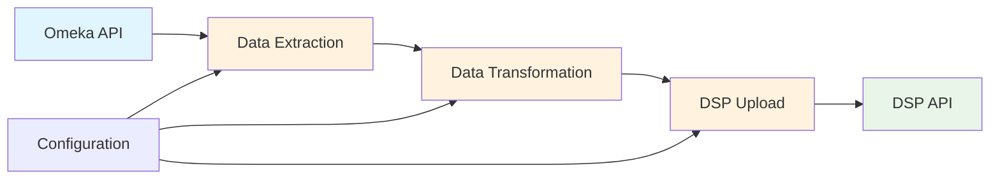

# omeka2dsp

This project contains the data model for the long-term preservation of the research data of [Stadt.Geschichte.Basel (SGB)](https://stadtgeschichtebasel.ch/) on the [DaSCH Service Platform (DSP)](https://www.dasch.swiss/plattform-characteristics) and the necessary scripts to transfer the research data from omeka to the DSP.

The script transfers the metadata and the associated media files from the SGB Omeka instance to the DSP. If a data object with the same id already exists on the DSP, the metadata is updated according to the omeka instance if it has changed.

[](https://github.com/koilebeit/omeka2dsp/issues)
[](https://github.com/koilebeit/omeka2dsp/network)
[](https://github.com/koilebeit/omeka2dsp/stargazers)
[](https://github.com/koilebeit/omeka2dsp/blob/main/LICENSE.md)

## 📚 Documentation

Comprehensive documentation is available in the [`docs/`](docs/) directory:

- **[📖 Complete Documentation](docs/README.md)** - Start here for full system documentation
- **[🏗️ Architecture Overview](docs/architecture/README.md)** - System design and components
- **[🔄 Workflows](docs/workflows/README.md)** - Data migration workflows with Mermaid diagrams
- **[🔧 API Reference](docs/api/README.md)** - Detailed Python function documentation

### 🚀 Quick Start Guides

- **[⚡ Installation & Setup](docs/guides/installation.md)** - Get up and running quickly
- **[⚙️ Configuration](docs/guides/configuration.md)** - Environment setup and customization
- **[📋 Usage Guide](docs/guides/usage.md)** - How to run migrations
- **[🛠️ Development](docs/guides/development.md)** - Contributing and extending
- **[🔍 Troubleshooting](docs/guides/troubleshooting.md)** - Common issues and solutions

## ⚡ Quick Installation

```bash
# Clone repository
git clone https://github.com/Stadt-Geschichte-Basel/omeka2dsp.git
cd omeka2dsp

# Install dependencies
npm install  # For development tools
pip install requests  # For Python dependencies

# Configure environment
cp example.env .env
# Edit .env with your credentials

# Test installation
python scripts/api_get_project.py
```

## 🚀 Quick Usage

```bash
# Run sample data migration (recommended for first test)
python scripts/data_2_dasch.py -m sample_data

# Run full migration
python scripts/data_2_dasch.py -m all_data

# Run test data migration
python scripts/data_2_dasch.py -m test_data
```

### Processing Modes

| Mode | Description | Use Case |
|------|-------------|----------|
| `all_data` | Process entire collection | Production migrations |
| `sample_data` | Process random subset | Testing and validation |
| `test_data` | Process predefined items | Development and debugging |

## 🏗️ System Architecture



The system transfers cultural heritage data from Omeka to the DaSCH Service Platform with:
- ✅ **Automated synchronization** - Detects and applies only necessary changes
- ✅ **Media file handling** - Transfers and processes associated files
- ✅ **Data validation** - Ensures data integrity throughout the process
- ✅ **Error recovery** - Robust error handling and retry mechanisms

## Support

This project is maintained by [@koilebeit](https://github.com/koilebeit). Please understand that we won't be able to provide individual support via email. We also believe that help is much more valuable if it's shared publicly, so that more people can benefit from it.

| Type                                   | Platforms                                                                |
| -------------------------------------- | ------------------------------------------------------------------------ |
| 🚨 **Bug Reports**                     | [GitHub Issue Tracker](https://github.com/koilebeit/omeka2dsp/issues)    |
| 📚 **Docs Issue**                      | [GitHub Issue Tracker](https://github.com/koilebeit/omeka2dsp/issues)    |
| 🎁 **Feature Requests**                | [GitHub Issue Tracker](https://github.com/koilebeit/omeka2dsp/issues)    |
| 🛡 **Report a security vulnerability** | See [SECURITY.md](SECURITY.md)                                           |
| 💬 **General Questions**               | [GitHub Discussions](https://github.com/koilebeit/omeka2dsp/discussions) |

## Roadmap

No changes are currently planned.

## Contributing

Please read [CONTRIBUTING.md](CONTRIBUTING.md) for details on our code of conduct, and the process for submitting pull requests to us.

## Versioning

We use [SemVer](http://semver.org/) for versioning. For the versions available, see the [tags on this repository](https://github.com/koilebeit/omeka2dsp/tags).

## Authors and acknowledgment

- **Nico Görlich** - _Initial work_ - [koilebeit](https://github.com/koilebeit)

See also the list of [contributors](https://github.com/koilebeit/omeka2dsp/graphs/contributors) who participated in this project.

## License

This project is licensed under the GNU Affero General Public License v3.0 - see the [LICENSE.md](LICENSE.md) file for details.
