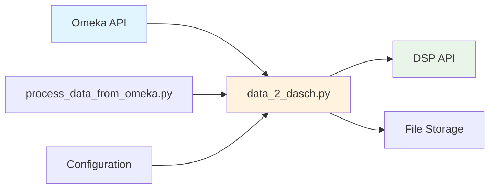

# omeka2dsp Documentation

Complete documentation for the Omeka to DaSCH Service Platform (DSP) data migration tool.

## Table of Contents

### 📚 Core Documentation
- [**System Architecture**](architecture/README.md) - Overview of system components and design
- [**Workflows**](workflows/README.md) - Data migration workflows with Mermaid diagrams
- [**API Reference**](api/README.md) - Detailed Python module and function documentation

### 🚀 Guides
- [**Installation & Setup**](guides/installation.md) - How to install and configure the system
- [**Configuration**](guides/configuration.md) - Environment variables and settings
- [**Usage Guide**](guides/usage.md) - How to run the migration scripts
- [**Development Guide**](guides/development.md) - Contributing and extending the codebase
- [**Troubleshooting**](guides/troubleshooting.md) - Common issues and solutions

## Quick Start

1. **Setup Environment**: Configure your environment variables (see [Configuration Guide](guides/configuration.md))
2. **Install Dependencies**: Install required Python packages
3. **Run Migration**: Execute the data transfer script

```bash
# Set up environment variables
cp example.env .env
# Edit .env with your configuration

# Run the migration
python scripts/data_2_dasch.py
```

## System Overview

The omeka2dsp system transfers research data from [Stadt.Geschichte.Basel (SGB)](https://stadtgeschichtebasel.ch/)'s Omeka instance to the [DaSCH Service Platform (DSP)](https://www.dasch.swiss/plattform-characteristics) for long-term preservation.

### Key Components



### Main Scripts

- **`data_2_dasch.py`** - Main migration script with sync capabilities
- **`process_data_from_omeka.py`** - Omeka API data extraction utilities
- **`api_get_project.py`** - Fetch DSP project information
- **`api_get_lists.py`** - Retrieve DSP list configurations
- **`api_get_lists_detailed.py`** - Get detailed list metadata

## Features

- ✅ **Full Data Migration** - Transfer metadata and media files
- ✅ **Incremental Sync** - Update existing resources with changes
- ✅ **Multiple Modes** - Process all data, samples, or test data
- ✅ **Error Handling** - Comprehensive logging and error recovery
- ✅ **Configuration** - Flexible environment-based configuration

## Architecture

The system follows a modular architecture with clear separation of concerns:

- **Data Extraction Layer** - Interfaces with Omeka API
- **Transformation Layer** - Converts data formats between systems
- **Upload Layer** - Manages file transfers and API interactions
- **Synchronization Layer** - Handles incremental updates and conflict resolution

For detailed architecture documentation, see [System Architecture](architecture/README.md).